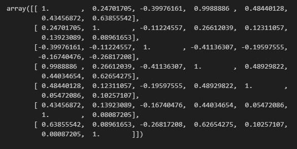
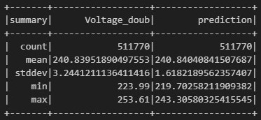
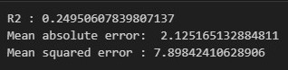

Simple linear regression for household power consumption voltage prediction using Pyspark

Dataset from kaggle: https://www.kaggle.com/datasets/uciml/electric-power-consumption-data-set/data

# Summary and metrics:

After some data cleaning we plot the **correlation matrix**

And obtain the following results

